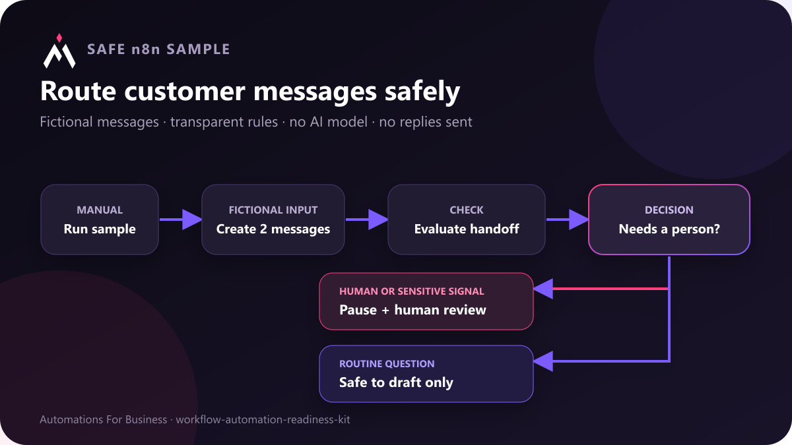

# Customer-message handoff review

This credential-free n8n example reviews two fictional customer messages and routes each one to a human queue or an assistant-draft queue. It demonstrates a visible handoff boundary without calling an AI model, sending a reply, or connecting to a customer system.



## What it demonstrates

1. An in-canvas note explains the safe sample boundary.
2. A manual trigger starts the example.
3. A Code node creates one routine question and one urgent human-request message.
4. A second Code node checks explicit human requests, review-topic terms, sensitive-data flags, open cases, and missing text.
5. An If node routes messages that need a person to `human_review_required`.
6. A routine sample goes to `safe_for_assistant_draft`, which is permission to draft only—not permission to send.

The term lists are a transparent teaching example, not a complete classifier. Production routing should reflect the business's policies, languages, channels, risk tolerance, and observed failure cases.

## Import and run

Import [`customer-message-handoff.workflow.json`](customer-message-handoff.workflow.json) into n8n, read the in-canvas note, and choose **Execute workflow**. No credentials are required.

For a local n8n CLI check:

```text
n8n import:workflow --input=customer-message-handoff.workflow.json
n8n execute --id=AFBMessageHandoff01 --rawOutput
```

## Expected result

- `sample-routine-001` ends in `safe_for_assistant_draft` because no handoff signal is present.
- `sample-human-002` ends in `human_review_required`. It detects an explicit human request, an open case, and the review terms `urgent` and `charge`.
- The workflow never sends either message.

The workflow also contains a full in-canvas overview covering the intended user, behavior, setup, requirements, customization boundary and human-handoff rule. This matches the current Creator Hub requirement for the complete template description inside a sticky note.

The exact isolated CLI check is recorded in [`customer-message-handoff-verification.md`](customer-message-handoff-verification.md).

## Adapting it safely

- Replace the fictional-source node only after mapping the channel's actual fields on non-sensitive data.
- Respect an explicit request for a person immediately.
- Add business-specific billing, security, legal, complaint, cancellation, and emergency rules.
- Avoid copying secrets or full payment, identity, health, or legal records into a general assistant prompt.
- Keep a named owner for the human queue and define how long automated replies stay paused.
- Test supported languages, spelling variations, sarcasm, empty messages, attachments, and repeated deliveries.
- Review false positives and false negatives before any reply node is enabled.

This workflow is a deterministic routing example. It is not a promise that keyword matching can understand every customer message.
