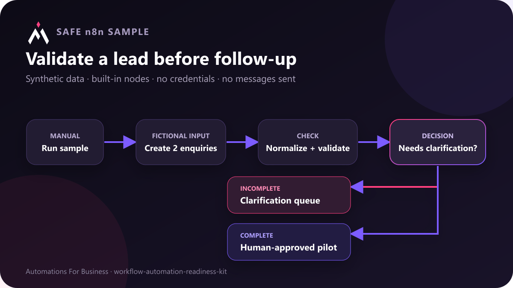

# Lead-enquiry review workflow for n8n

This small workflow shows how to validate an enquiry before anyone builds a customer-facing automation around it. It uses only synthetic data and built-in n8n nodes. It does not require credentials, call an external service, or send a message.



## What the workflow demonstrates

1. An in-canvas note explains the safe sample boundary before the workflow is run.
2. A manual trigger starts a safe local test.
3. A Code node creates two fictional enquiries: one complete and one incomplete.
4. A second Code node trims fields, normalizes the email address, detects missing information, and creates a non-secret sample fingerprint.
5. An If node routes incomplete enquiries to a clarification queue.
6. Complete enquiries are marked ready for a small pilot that still requires human approval.

The workflow never treats validation as permission to contact a customer. The final output is a review record, not a sent email or updated CRM entry.

The workflow also contains a full in-canvas overview covering the intended user, behavior, setup, requirements, customization boundary and human-approval rule. This follows the current n8n Creator Hub requirement that a submitted template include its complete description in a sticky note.

## Import and run

Use the n8n editor's **Import from File** option and select [`lead-enquiry-review.workflow.json`](lead-enquiry-review.workflow.json). Then open the workflow and choose **Execute workflow**.

For a local self-hosted n8n installation, the Server CLI can also import the file:

```text
n8n import:workflow --input=lead-enquiry-review.workflow.json
```

List the imported workflows to get its ID, then run it:

```text
n8n list:workflow
n8n execute --id=<workflow-id> --rawOutput
```

## Expected result

- `sample-complete-001` follows the false branch of **Needs clarification?** and ends with `reviewState` set to `ready_for_human_approved_pilot`.
- `sample-needs-details-002` follows the true branch and ends with `reviewState` set to `needs_clarification`.
- Both records retain the validation explanation, missing-field list, and next action for a person to review.

## Adapting it safely

Replace the sample-creation node with a form, CRM, spreadsheet, or help-desk trigger only after testing the field mapping on non-sensitive data. Keep the validation step and the human review step. Add any sending or updating node only when the workflow has an owner, a rollback plan, and an approved customer-facing message.

Do not place real passwords, API keys, private customer records, or access tokens in the workflow JSON.
