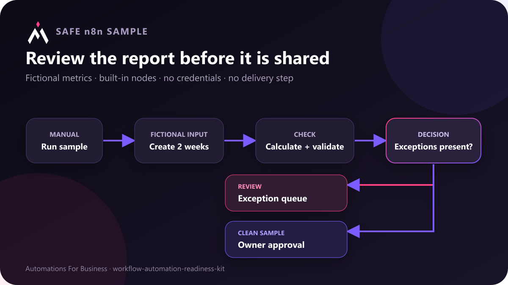

# Weekly operating report review

This credential-free n8n example turns two fictional weekly summaries into a small review queue. It calculates two rates, validates the report, and keeps a person responsible for exceptions and final approval.



## What it demonstrates

1. An in-canvas note explains the safe sample boundary before the workflow is run.
2. A manual trigger starts the example.
3. Two fictional weekly records are created inside the workflow.
4. The workflow normalizes numeric inputs and calculates request and completion rates.
5. Missing ownership, critical exceptions, overdue items, or inconsistent totals create a review reason.
6. A clean sample goes to `ready_for_owner_approval`.
7. A sample with exceptions goes to `needs_exception_review`.

It does not connect to analytics, a CRM, email, a spreadsheet, or a customer system. Replace the fictional source only after defining who owns the report, which source is authoritative, and what should stop automatic sharing.

## Import and run

Import [`weekly-report-review.workflow.json`](weekly-report-review.workflow.json) into n8n, open the workflow, and choose **Execute workflow**. No credentials are required.

For a local n8n CLI check:

```text
n8n import:workflow --input=weekly-report-review.workflow.json
n8n execute --id=AFBWeeklyReport01 --rawOutput
```

## Safe adaptation checklist

- Confirm the date range and timezone.
- Choose one authoritative source for every metric.
- Define how late-arriving records are handled.
- Assign a person to investigate exceptions.
- Compare the draft with the source before sending it.
- Keep report delivery disabled until sample runs are correct.
- Record what changed when a corrected report is approved.

The percentages in this workflow are derived from fictional values. They are not business results or a customer case study.
